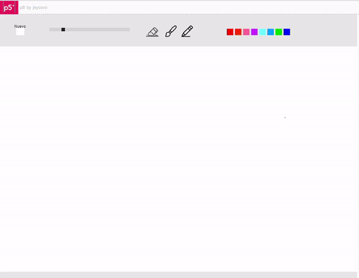

# CIU-P8-paint
## Autor
Jacobo Placeres Cabrera

## Trabajo
El proyecto consiste en diseñar un paint con algunas funcionalidades de dibujo.

## Eventos
Mediante el empleo del ratón se van haciendo los cambios de color, así como eligiendo el tamaño del puntero, también se puede elegir entre las herramientas disponibles, que son la goma de borrar, el pincel y el lapiz.

# Librerias empleadas
* [p5.Clickable](https://github.com/Lartu/p5.clickable)

# Notas de uso
+**Seleccion de color:** Los colores disponibles se muestran arriba a la derecha, se pueden seleccional mediante el raton.
+**Herramientas:** La goma de borrar permite borrar los trazos, el pincel puede variar su tamaño pero tiene una linea menos consistente, el lapiz siempre tiene el mismo tamaño pero su trazado es consistente.
+**Cambio de tamaño:** Tanto la goma como el pincel son afectados por el cambio de tamaño.
+**Nueva hoja:** Al clicar en este boton, se limpia el lienzo.
# Referencias
***[Iconos](www.flaticon.com)**
***[Reference](https://p5js.org/reference/)**

*[Si quieres probarlo...](https://editor.p5js.org/jeycovo/full/uhSGrSH6J)**
